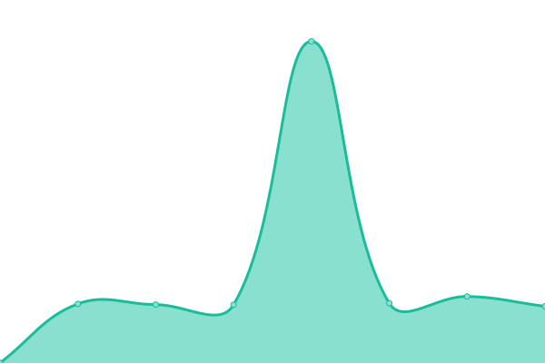
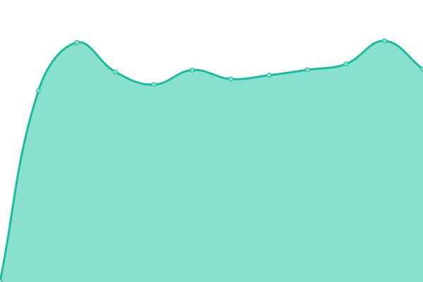
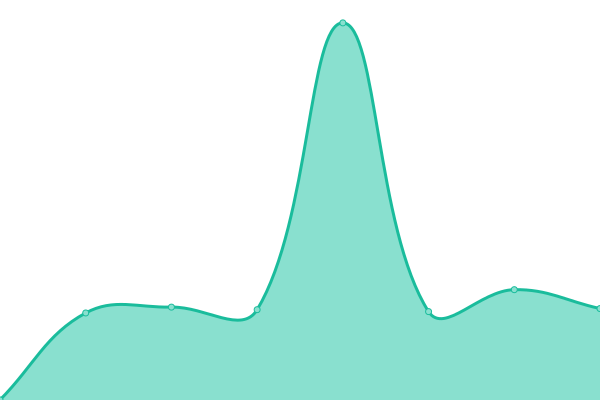
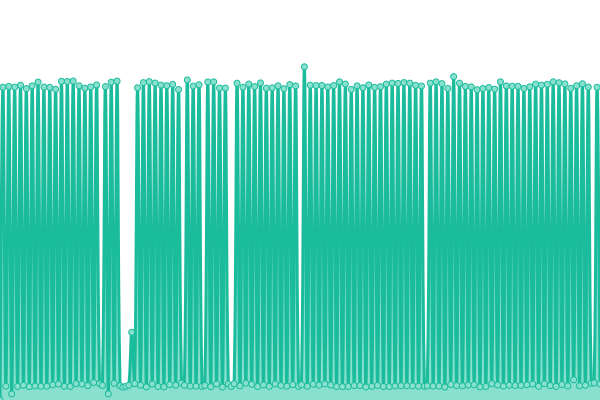
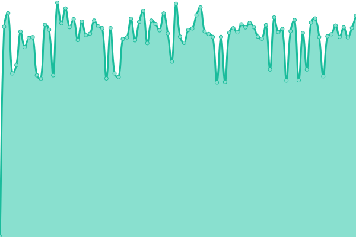

# [📈 Live Status](https://upptime.github.io/upptime): <!--live status--> **🟧 Partial outage**

This repository contains the open-source uptime monitor and status page for [Upptime](https://upptime.js.org), powered by [Upptime](https://github.com/upptime/upptime).

With [Upptime](https://upptime.js.org), you can get your own unlimited and free uptime monitor and status page, powered entirely by a GitHub repository. We use [Issues](https://github.com/upptime/upptime/issues) as incident reports, [Actions](https://github.com/shruthie2/upptime/actions) as uptime monitors, and [Pages](https://upptime.github.io/upptime) for the status page.

<!--start: status pages-->
<!-- This summary is generated by Upptime (https://github.com/upptime/upptime) -->
<!-- Do not edit this manually, your changes will be overwritten -->
<!-- prettier-ignore -->
| URL | Status | History | Response Time | Uptime |
| --- | ------ | ------- | ------------- | ------ |
|  [shruthiprom1](https://shruthiprom1.glitch.me) | 🟩 Up | [shruthiprom1.yml](https://github.com/shruthie2/uptime/commits/HEAD/history/shruthiprom1.yml) | 

 579ms
     
 | 

<a href="https://shruthie2.github.io/uptime/history/shruthiprom1">0.00%</a>
    

|  [kavyaprom1](https://kavyaprom1.glitch.me) | 🟩 Up | [kavyaprom1.yml](https://github.com/shruthie2/uptime/commits/HEAD/history/kavyaprom1.yml) | 

 452ms
     
 | 

<a href="https://shruthie2.github.io/uptime/history/kavyaprom1">0.00%</a>
    

|  [snehaProm1](https://snehaProm1.glitch.me) | 🟩 Up | [sneha-prom1.yml](https://github.com/shruthie2/uptime/commits/HEAD/history/sneha-prom1.yml) | 

 417ms
     
 | 

<a href="https://shruthie2.github.io/uptime/history/sneha-prom1">0.00%</a>
    

|  [meghanaprom1](https://meghanaprom1.glitch.me) | 🟩 Up | [meghanaprom1.yml](https://github.com/shruthie2/uptime/commits/HEAD/history/meghanaprom1.yml) | 

 605ms
     
 | 

<a href="https://shruthie2.github.io/uptime/history/meghanaprom1">33.71%</a>
    

|  [ramyaprom01](https://ramyaprom01.glitch.me) | 🟩 Up | [ramyaprom01.yml](https://github.com/shruthie2/uptime/commits/HEAD/history/ramyaprom01.yml) | 

 512ms
     
 | 

<a href="https://shruthie2.github.io/uptime/history/ramyaprom01">0.00%</a>
    

|  [nidhiprom1](https://nidhiprom1.glitch.me) | 🟩 Up | [nidhiprom1.yml](https://github.com/shruthie2/uptime/commits/HEAD/history/nidhiprom1.yml) | 

 572ms
     
 | 

<a href="https://shruthie2.github.io/uptime/history/nidhiprom1">0.00%</a>
    

|  [sowmyaprom1](https://sowmyaprom1.glitch.me) | 🟩 Up | [sowmyaprom1.yml](https://github.com/shruthie2/uptime/commits/HEAD/history/sowmyaprom1.yml) | 

 429ms
     
 | 

<a href="https://shruthie2.github.io/uptime/history/sowmyaprom1">31.14%</a>
    

|  [divyaprom1](https://divyaprom1.glitch.me) | 🟩 Up | [divyaprom1.yml](https://github.com/shruthie2/uptime/commits/HEAD/history/divyaprom1.yml) | 

 425ms
     
 | 

<a href="https://shruthie2.github.io/uptime/history/divyaprom1">33.71%</a>
    

|  [keerthiprom1](https://keerthiprom1.glitch.me) | 🟩 Up | [keerthiprom1.yml](https://github.com/shruthie2/uptime/commits/HEAD/history/keerthiprom1.yml) | 

 528ms
     
 | 

<a href="https://shruthie2.github.io/uptime/history/keerthiprom1">100.00%</a>
    

|  [kavyaprom2](https://kavyaprom2.glitch.me) | 🟩 Up | [kavyaprom2.yml](https://github.com/shruthie2/uptime/commits/HEAD/history/kavyaprom2.yml) | 

 435ms
     
 | 

<a href="https://shruthie2.github.io/uptime/history/kavyaprom2">99.78%</a>
    

|  [arpithaprom1](https://arpithaprom1.glitch.me) | 🟩 Up | [arpithaprom1.yml](https://github.com/shruthie2/uptime/commits/HEAD/history/arpithaprom1.yml) | 

 767ms
     
 | 

<a href="https://shruthie2.github.io/uptime/history/arpithaprom1">100.00%</a>
    

|  [divyaprom2](https://divyaprom2.glitch.me) | 🟩 Up | [divyaprom2.yml](https://github.com/shruthie2/uptime/commits/HEAD/history/divyaprom2.yml) | 

 496ms
     
 | 

<a href="https://shruthie2.github.io/uptime/history/divyaprom2">31.14%</a>
    

|  [sowmyaprom2](https://sowmyaprom2.glitch.me) | 🟩 Up | [sowmyaprom2.yml](https://github.com/shruthie2/uptime/commits/HEAD/history/sowmyaprom2.yml) | 

 343ms
     
 | 

<a href="https://shruthie2.github.io/uptime/history/sowmyaprom2">100.00%</a>
    

|  [shruthiprom02](https://shruthiprom02.glitch.me) | 🟩 Up | [shruthiprom02.yml](https://github.com/shruthie2/uptime/commits/HEAD/history/shruthiprom02.yml) | 

 404ms
     
 | 

<a href="https://shruthie2.github.io/uptime/history/shruthiprom02">0.00%</a>
    

|  [keerthiprom2](https://keerthiprom2.glitch.me) | 🟩 Up | [keerthiprom2.yml](https://github.com/shruthie2/uptime/commits/HEAD/history/keerthiprom2.yml) | 

 577ms
     
 | 

<a href="https://shruthie2.github.io/uptime/history/keerthiprom2">100.00%</a>
    

|  [nidhiprom2](https://nidhiprom2.glitch.me) | 🟩 Up | [nidhiprom2.yml](https://github.com/shruthie2/uptime/commits/HEAD/history/nidhiprom2.yml) | 

 483ms
     
 | 

<a href="https://shruthie2.github.io/uptime/history/nidhiprom2">100.00%</a>
    

|  [meghanaprom2](https://meghanaprom2.glitch.me) | 🟩 Up | [meghanaprom2.yml](https://github.com/shruthie2/uptime/commits/HEAD/history/meghanaprom2.yml) | 

 442ms
     
 | 

<a href="https://shruthie2.github.io/uptime/history/meghanaprom2">100.00%</a>
    

|  [ramyaprom2](https://ramyaprom2.glitch.me) | 🟩 Up | [ramyaprom2.yml](https://github.com/shruthie2/uptime/commits/HEAD/history/ramyaprom2.yml) | 

 433ms
     
 | 

<a href="https://shruthie2.github.io/uptime/history/ramyaprom2">0.00%</a>
    

|  [arpithaprom2](https://arpithaprom2.glitch.me) | 🟩 Up | [arpithaprom2.yml](https://github.com/shruthie2/uptime/commits/HEAD/history/arpithaprom2.yml) | 

 478ms
     
 | 

<a href="https://shruthie2.github.io/uptime/history/arpithaprom2">100.00%</a>
    

|  [snehaprom2](https://snehaprom2.glitch.me) | 🟩 Up | [snehaprom2.yml](https://github.com/shruthie2/uptime/commits/HEAD/history/snehaprom2.yml) | 

 424ms
     
 | 

<a href="https://shruthie2.github.io/uptime/history/snehaprom2">100.00%</a>
    

|  [shruthi1](https://shruthi1.glitch.me) | 🟩 Up | [shruthi1.yml](https://github.com/shruthie2/uptime/commits/HEAD/history/shruthi1.yml) | 

 462ms
     
 | 

<a href="https://shruthie2.github.io/uptime/history/shruthi1">0.00%</a>
    

|  [kavya1](https://kavya1.glitch.me) | 🟩 Up | [kavya1.yml](https://github.com/shruthie2/uptime/commits/HEAD/history/kavya1.yml) | 

 386ms
     
 | 

<a href="https://shruthie2.github.io/uptime/history/kavya1">100.00%</a>
    

|  [sneha1](https://sneha1.glitch.me) | 🟩 Up | [sneha1.yml](https://github.com/shruthie2/uptime/commits/HEAD/history/sneha1.yml) | 

 491ms
     
 | 

<a href="https://shruthie2.github.io/uptime/history/sneha1">61.77%</a>
    

|  [meghana1](https://meghana1.glitch.me) | 🟩 Up | [meghana1.yml](https://github.com/shruthie2/uptime/commits/HEAD/history/meghana1.yml) | 

 388ms
     
 | 

<a href="https://shruthie2.github.io/uptime/history/meghana1">0.00%</a>
    

|  [ramya1](https://ramya1.glitch.me) | 🟩 Up | [ramya1.yml](https://github.com/shruthie2/uptime/commits/HEAD/history/ramya1.yml) | 

 476ms
     
 | 

<a href="https://shruthie2.github.io/uptime/history/ramya1">99.81%</a>
    

|  [nidhi1](https://nidhi1.glitch.me) | 🟩 Up | [nidhi1.yml](https://github.com/shruthie2/uptime/commits/HEAD/history/nidhi1.yml) | 

 333ms
     
 | 

<a href="https://shruthie2.github.io/uptime/history/nidhi1">100.00%</a>
    

|  [sowmya1](https://sowmya1.glitch.me) | 🟩 Up | [sowmya1.yml](https://github.com/shruthie2/uptime/commits/HEAD/history/sowmya1.yml) | 

 364ms
     
 | 

<a href="https://shruthie2.github.io/uptime/history/sowmya1">0.00%</a>
    

|  [divya1](https://divya1.glitch.me) | 🟥 Down | [divya1.yml](https://github.com/shruthie2/uptime/commits/HEAD/history/divya1.yml) | 

 200ms
     
 | 

<a href="https://shruthie2.github.io/uptime/history/divya1">0.00%</a>
    

|  [keerthi1](https://keerthi1.glitch.me) | 🟩 Up | [keerthi1.yml](https://github.com/shruthie2/uptime/commits/HEAD/history/keerthi1.yml) | 

 425ms
     
 | 

<a href="https://shruthie2.github.io/uptime/history/keerthi1">47.76%</a>
    

|  [kavya4](https://kavya4.glitch.me) | 🟩 Up | [kavya4.yml](https://github.com/shruthie2/uptime/commits/HEAD/history/kavya4.yml) | 

 459ms
     
 | 

<a href="https://shruthie2.github.io/uptime/history/kavya4">75.15%</a>
    

|  [arpitha1](https://arpitha1.glitch.me) | 🟥 Down | [arpitha1.yml](https://github.com/shruthie2/uptime/commits/HEAD/history/arpitha1.yml) | 

 329ms
     
 | 

<a href="https://shruthie2.github.io/uptime/history/arpitha1">94.72%</a>
    

|  [divya2](https://divya2.glitch.me) | 🟩 Up | [divya2.yml](https://github.com/shruthie2/uptime/commits/HEAD/history/divya2.yml) | 

 399ms
     
 | 

<a href="https://shruthie2.github.io/uptime/history/divya2">86.57%</a>
    

|  [sowmya2](https://sowmya2.glitch.me) | 🟩 Up | [sowmya2.yml](https://github.com/shruthie2/uptime/commits/HEAD/history/sowmya2.yml) | 

 446ms
     
 | 

<a href="https://shruthie2.github.io/uptime/history/sowmya2">86.61%</a>
    

|  [shruthi2](https://shruthi2.glitch.me) | 🟩 Up | [shruthi2.yml](https://github.com/shruthie2/uptime/commits/HEAD/history/shruthi2.yml) | 

 349ms
     
 | 

<a href="https://shruthie2.github.io/uptime/history/shruthi2">0.00%</a>
    

|  [keerthi2](https://keerthi2.glitch.me) | 🟩 Up | [keerthi2.yml](https://github.com/shruthie2/uptime/commits/HEAD/history/keerthi2.yml) | 

 413ms
     
 | 

<a href="https://shruthie2.github.io/uptime/history/keerthi2">45.47%</a>
    

|  [nidhi2](https://nidhi2.glitch.me) | 🟩 Up | [nidhi2.yml](https://github.com/shruthie2/uptime/commits/HEAD/history/nidhi2.yml) | 

 392ms
     
 | 

<a href="https://shruthie2.github.io/uptime/history/nidhi2">0.00%</a>
    

|  [meghana2](https://meghana2.glitch.me) | 🟩 Up | [meghana2.yml](https://github.com/shruthie2/uptime/commits/HEAD/history/meghana2.yml) | 

 564ms
     
 | 

<a href="https://shruthie2.github.io/uptime/history/meghana2">0.00%</a>
    

|  [ramya2](https://ramya2.glitch.me) | 🟩 Up | [ramya2.yml](https://github.com/shruthie2/uptime/commits/HEAD/history/ramya2.yml) | 

 426ms
     
 | 

<a href="https://shruthie2.github.io/uptime/history/ramya2">0.00%</a>
    

|  [arpitha3](https://arpitha3.glitch.me) | 🟩 Up | [arpitha3.yml](https://github.com/shruthie2/uptime/commits/HEAD/history/arpitha3.yml) | 

 418ms
     
 | 

<a href="https://shruthie2.github.io/uptime/history/arpitha3">0.00%</a>
    

|  [sneha2](https://sneha2.glitch.me) | 🟩 Up | [sneha2.yml](https://github.com/shruthie2/uptime/commits/HEAD/history/sneha2.yml) | 

 409ms
     
 | 

<a href="https://shruthie2.github.io/uptime/history/sneha2">0.00%</a>
    

<!--end: status pages-->

[**Visit our status website →**](https://upptime.github.io/upptime)

## 📄 License

- Powered by: [Upptime](https://github.com/upptime/upptime)
- Code: [MIT](./LICENSE) © [Anand Chowdhary](https://anandchowdhary.com), supported by [Pabio](https://pabio.com)
- Data in the `./history` directory: [Open Database License](https://opendatacommons.org/licenses/odbl/1-0/)
