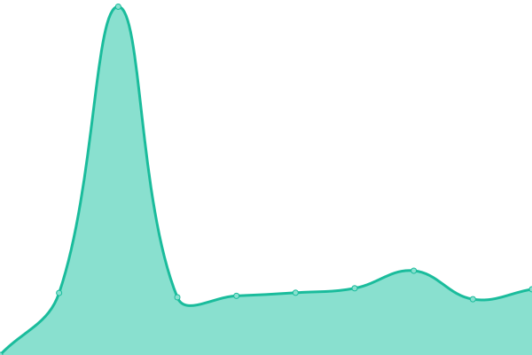

# [📈 Live Status](https://upptime.github.io/upptime): <!--live status--> **🟧 Partial outage**

This repository contains the open-source uptime monitor and status page for [Upptime](https://upptime.js.org), powered by [Upptime](https://github.com/upptime/upptime).

With [Upptime](https://upptime.js.org), you can get your own unlimited and free uptime monitor and status page, powered entirely by a GitHub repository. We use [Issues](https://github.com/upptime/upptime/issues) as incident reports, [Actions](https://github.com/shruthie2/upptime/actions) as uptime monitors, and [Pages](https://upptime.github.io/upptime) for the status page.

<!--start: status pages-->
<!-- This summary is generated by Upptime (https://github.com/upptime/upptime) -->
<!-- Do not edit this manually, your changes will be overwritten -->
<!-- prettier-ignore -->
| URL | Status | History | Response Time | Uptime |
| --- | ------ | ------- | ------------- | ------ |
|  [shruthiprom1](https://shruthiprom1.glitch.me) | 🟩 Up | [shruthiprom1.yml](https://github.com/shruthie2/uptime/commits/HEAD/history/shruthiprom1.yml) | 

 422ms
     
 | 

<a href="https://shruthie2.github.io/uptime/history/shruthiprom1">41.76%</a>
    

|  [kavyaprom1](https://kavyaprom1.glitch.me) | 🟩 Up | [kavyaprom1.yml](https://github.com/shruthie2/uptime/commits/HEAD/history/kavyaprom1.yml) | 

 410ms
     
 | 

<a href="https://shruthie2.github.io/uptime/history/kavyaprom1">0.00%</a>
    

|  [snehaProm1](https://snehaProm1.glitch.me) | 🟩 Up | [sneha-prom1.yml](https://github.com/shruthie2/uptime/commits/HEAD/history/sneha-prom1.yml) | 

 441ms
     
 | 

<a href="https://shruthie2.github.io/uptime/history/sneha-prom1">99.25%</a>
    

|  [meghanaprom1](https://meghanaprom1.glitch.me) | 🟩 Up | [meghanaprom1.yml](https://github.com/shruthie2/uptime/commits/HEAD/history/meghanaprom1.yml) | 

 355ms
     
 | 

<a href="https://shruthie2.github.io/uptime/history/meghanaprom1">1.15%</a>
    

|  [ramyaprom01](https://ramyaprom01.glitch.me) | 🟩 Up | [ramyaprom01.yml](https://github.com/shruthie2/uptime/commits/HEAD/history/ramyaprom01.yml) | 

 448ms
     
 | 

<a href="https://shruthie2.github.io/uptime/history/ramyaprom01">39.43%</a>
    

|  [nidhiprom1](https://nidhiprom1.glitch.me) | 🟩 Up | [nidhiprom1.yml](https://github.com/shruthie2/uptime/commits/HEAD/history/nidhiprom1.yml) | 

 541ms
     
 | 

<a href="https://shruthie2.github.io/uptime/history/nidhiprom1">100.00%</a>
    

|  [sowmyaprom1](https://sowmyaprom1.glitch.me) | 🟩 Up | [sowmyaprom1.yml](https://github.com/shruthie2/uptime/commits/HEAD/history/sowmyaprom1.yml) | 

 579ms
     
 | 

<a href="https://shruthie2.github.io/uptime/history/sowmyaprom1">99.22%</a>
    

|  [divyaprom1](https://divyaprom1.glitch.me) | 🟩 Up | [divyaprom1.yml](https://github.com/shruthie2/uptime/commits/HEAD/history/divyaprom1.yml) | 

 2348ms
     
 | 

<a href="https://shruthie2.github.io/uptime/history/divyaprom1">99.49%</a>
    

|  [keerthiprom1](https://keerthiprom1.glitch.me) | 🟩 Up | [keerthiprom1.yml](https://github.com/shruthie2/uptime/commits/HEAD/history/keerthiprom1.yml) | 

 336ms
     
 | 

<a href="https://shruthie2.github.io/uptime/history/keerthiprom1">68.54%</a>
    

|  [kavyaprom2](https://kavyaprom2.glitch.me) | 🟩 Up | [kavyaprom2.yml](https://github.com/shruthie2/uptime/commits/HEAD/history/kavyaprom2.yml) | 

 513ms
     
 | 

<a href="https://shruthie2.github.io/uptime/history/kavyaprom2">100.00%</a>
    

|  [arpithaprom1](https://arpithaprom1.glitch.me) | 🟩 Up | [arpithaprom1.yml](https://github.com/shruthie2/uptime/commits/HEAD/history/arpithaprom1.yml) | 

 370ms
     
 | 

<a href="https://shruthie2.github.io/uptime/history/arpithaprom1">85.90%</a>
    

|  [divyaprom2](https://divyaprom2.glitch.me) | 🟩 Up | [divyaprom2.yml](https://github.com/shruthie2/uptime/commits/HEAD/history/divyaprom2.yml) | 

 747ms
     
 | 

<a href="https://shruthie2.github.io/uptime/history/divyaprom2">99.73%</a>
    

|  [sowmyaprom2](https://sowmyaprom2.glitch.me) | 🟩 Up | [sowmyaprom2.yml](https://github.com/shruthie2/uptime/commits/HEAD/history/sowmyaprom2.yml) | 

 597ms
     
 | 

<a href="https://shruthie2.github.io/uptime/history/sowmyaprom2">98.96%</a>
    

|  [shruthiprom02](https://shruthiprom02.glitch.me) | 🟩 Up | [shruthiprom02.yml](https://github.com/shruthie2/uptime/commits/HEAD/history/shruthiprom02.yml) | 

 322ms
     
 | 

<a href="https://shruthie2.github.io/uptime/history/shruthiprom02">72.46%</a>
    

|  [keerthiprom2](https://keerthiprom2.glitch.me) | 🟩 Up | [keerthiprom2.yml](https://github.com/shruthie2/uptime/commits/HEAD/history/keerthiprom2.yml) | 

 925ms
     
 | 

<a href="https://shruthie2.github.io/uptime/history/keerthiprom2">68.84%</a>
    

|  [nidhiprom2](https://nidhiprom2.glitch.me) | 🟩 Up | [nidhiprom2.yml](https://github.com/shruthie2/uptime/commits/HEAD/history/nidhiprom2.yml) | 

 353ms
     
 | 

<a href="https://shruthie2.github.io/uptime/history/nidhiprom2">100.00%</a>
    

|  [meghanaprom2](https://meghanaprom2.glitch.me) | 🟩 Up | [meghanaprom2.yml](https://github.com/shruthie2/uptime/commits/HEAD/history/meghanaprom2.yml) | 

 431ms
     
 | 

<a href="https://shruthie2.github.io/uptime/history/meghanaprom2">40.81%</a>
    

|  [ramyaprom2](https://ramyaprom2.glitch.me) | 🟩 Up | [ramyaprom2.yml](https://github.com/shruthie2/uptime/commits/HEAD/history/ramyaprom2.yml) | 

 1257ms
     
 | 

<a href="https://shruthie2.github.io/uptime/history/ramyaprom2">97.34%</a>
    

|  [arpithaprom2](https://arpithaprom2.glitch.me) | 🟩 Up | [arpithaprom2.yml](https://github.com/shruthie2/uptime/commits/HEAD/history/arpithaprom2.yml) | 

 2754ms
     
 | 

<a href="https://shruthie2.github.io/uptime/history/arpithaprom2">86.51%</a>
    

|  [snehaprom2](https://snehaprom2.glitch.me) | 🟩 Up | [snehaprom2.yml](https://github.com/shruthie2/uptime/commits/HEAD/history/snehaprom2.yml) | 

 371ms
     
 | 

<a href="https://shruthie2.github.io/uptime/history/snehaprom2">99.34%</a>
    

|  [shruthi1](https://shruthi1.glitch.me) | 🟥 Down | [shruthi1.yml](https://github.com/shruthie2/uptime/commits/HEAD/history/shruthi1.yml) | 

 400ms
     
 | 

<a href="https://shruthie2.github.io/uptime/history/shruthi1">88.63%</a>
    

|  [kavya1](https://kavya1.glitch.me) | 🟩 Up | [kavya1.yml](https://github.com/shruthie2/uptime/commits/HEAD/history/kavya1.yml) | 

 339ms
     
 | 

<a href="https://shruthie2.github.io/uptime/history/kavya1">93.92%</a>
    

|  [sneha1](https://sneha1.glitch.me) | 🟥 Down | [sneha1.yml](https://github.com/shruthie2/uptime/commits/HEAD/history/sneha1.yml) | 

 402ms
     
 | 

<a href="https://shruthie2.github.io/uptime/history/sneha1">89.34%</a>
    

|  [meghana1](https://meghana1.glitch.me) | 🟥 Down | [meghana1.yml](https://github.com/shruthie2/uptime/commits/HEAD/history/meghana1.yml) | 

 466ms
     
 | 

<a href="https://shruthie2.github.io/uptime/history/meghana1">88.94%</a>
    

|  [ramya1](https://ramya1.glitch.me) | 🟩 Up | [ramya1.yml](https://github.com/shruthie2/uptime/commits/HEAD/history/ramya1.yml) | 

 4119ms
     
 | 

<a href="https://shruthie2.github.io/uptime/history/ramya1">94.55%</a>
    

|  [nidhi1](https://nidhi1.glitch.me) | 🟥 Down | [nidhi1.yml](https://github.com/shruthie2/uptime/commits/HEAD/history/nidhi1.yml) | 

 1662ms
     
 | 

<a href="https://shruthie2.github.io/uptime/history/nidhi1">6.90%</a>
    

|  [sowmya1](https://sowmya1.glitch.me) | 🟥 Down | [sowmya1.yml](https://github.com/shruthie2/uptime/commits/HEAD/history/sowmya1.yml) | 

 461ms
     
 | 

<a href="https://shruthie2.github.io/uptime/history/sowmya1">90.79%</a>
    

|  [divya1](https://divya1.glitch.me) | 🟥 Down | [divya1.yml](https://github.com/shruthie2/uptime/commits/HEAD/history/divya1.yml) | 

 183ms
     
 | 

<a href="https://shruthie2.github.io/uptime/history/divya1">0.00%</a>
    

|  [keerthi1](https://keerthi1.glitch.me) | 🟥 Down | [keerthi1.yml](https://github.com/shruthie2/uptime/commits/HEAD/history/keerthi1.yml) | 

 364ms
     
 | 

<a href="https://shruthie2.github.io/uptime/history/keerthi1">95.44%</a>
    

|  [kavya4](https://kavya4.glitch.me) | 🟥 Down | [kavya4.yml](https://github.com/shruthie2/uptime/commits/HEAD/history/kavya4.yml) | 

 718ms
     
 | 

<a href="https://shruthie2.github.io/uptime/history/kavya4">0.00%</a>
    

|  [arpitha1](https://arpitha1.glitch.me) | 🟩 Up | [arpitha1.yml](https://github.com/shruthie2/uptime/commits/HEAD/history/arpitha1.yml) | 

 408ms
     
 | 

<a href="https://shruthie2.github.io/uptime/history/arpitha1">0.47%</a>
    

|  [divya2](https://divya2.glitch.me) | 🟥 Down | [divya2.yml](https://github.com/shruthie2/uptime/commits/HEAD/history/divya2.yml) | 

 949ms
     
 | 

<a href="https://shruthie2.github.io/uptime/history/divya2">89.68%</a>
    

|  [sowmya2](https://sowmya2.glitch.me) | 🟩 Up | [sowmya2.yml](https://github.com/shruthie2/uptime/commits/HEAD/history/sowmya2.yml) | 

 341ms
     
 | 

<a href="https://shruthie2.github.io/uptime/history/sowmya2">99.41%</a>
    

|  [shruthi2](https://shruthi2.glitch.me) | 🟥 Down | [shruthi2.yml](https://github.com/shruthie2/uptime/commits/HEAD/history/shruthi2.yml) | 

 430ms
     
 | 

<a href="https://shruthie2.github.io/uptime/history/shruthi2">95.62%</a>
    

|  [keerthi2](https://keerthi2.glitch.me) | 🟥 Down | [keerthi2.yml](https://github.com/shruthie2/uptime/commits/HEAD/history/keerthi2.yml) | 

 407ms
     
 | 

<a href="https://shruthie2.github.io/uptime/history/keerthi2">89.88%</a>
    

|  [nidhi2](https://nidhi2.glitch.me) | 🟥 Down | [nidhi2.yml](https://github.com/shruthie2/uptime/commits/HEAD/history/nidhi2.yml) | 

 442ms
     
 | 

<a href="https://shruthie2.github.io/uptime/history/nidhi2">82.83%</a>
    

|  [meghana2](https://meghana2.glitch.me) | 🟥 Down | [meghana2.yml](https://github.com/shruthie2/uptime/commits/HEAD/history/meghana2.yml) | 

 342ms
     
 | 

<a href="https://shruthie2.github.io/uptime/history/meghana2">94.34%</a>
    

|  [ramya2](https://ramya2.glitch.me) | 🟥 Down | [ramya2.yml](https://github.com/shruthie2/uptime/commits/HEAD/history/ramya2.yml) | 

 324ms
     
 | 

<a href="https://shruthie2.github.io/uptime/history/ramya2">90.00%</a>
    

|  [arpitha3](https://arpitha3.glitch.me) | 🟩 Up | [arpitha3.yml](https://github.com/shruthie2/uptime/commits/HEAD/history/arpitha3.yml) | 

 348ms
     
 | 

<a href="https://shruthie2.github.io/uptime/history/arpitha3">95.85%</a>
    

|  [sneha2](https://sneha2.glitch.me) | 🟥 Down | [sneha2.yml](https://github.com/shruthie2/uptime/commits/HEAD/history/sneha2.yml) | 

 437ms
     
 | 

<a href="https://shruthie2.github.io/uptime/history/sneha2">94.52%</a>
    

<!--end: status pages-->

[**Visit our status website →**](https://upptime.github.io/upptime)

## 📄 License

- Powered by: [Upptime](https://github.com/upptime/upptime)
- Code: [MIT](./LICENSE) © [Anand Chowdhary](https://anandchowdhary.com), supported by [Pabio](https://pabio.com)
- Data in the `./history` directory: [Open Database License](https://opendatacommons.org/licenses/odbl/1-0/)
